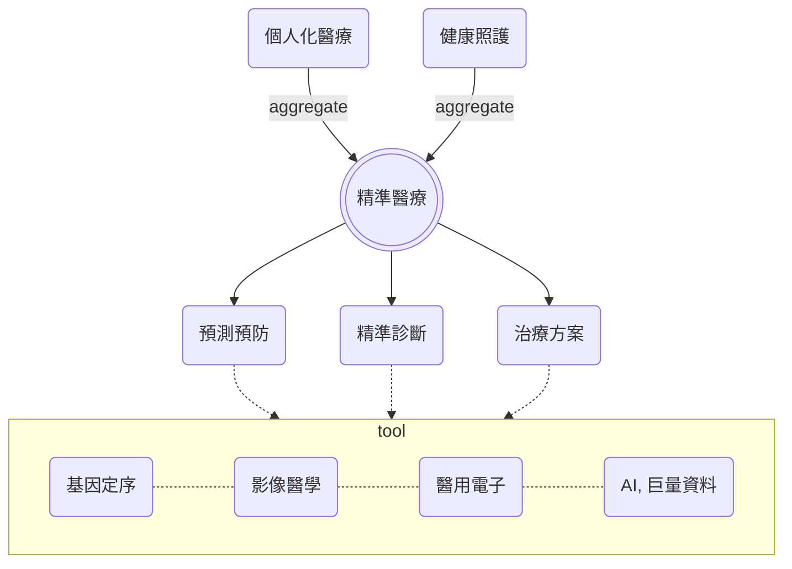
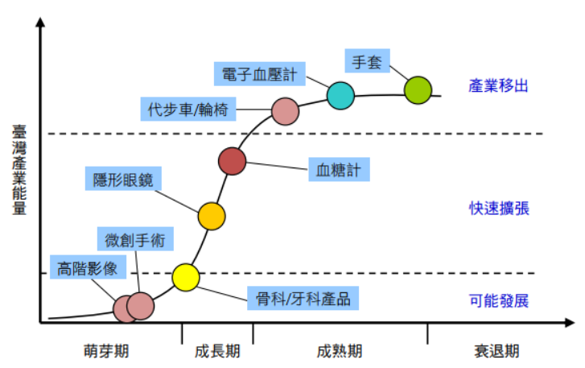
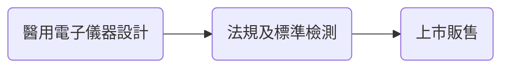
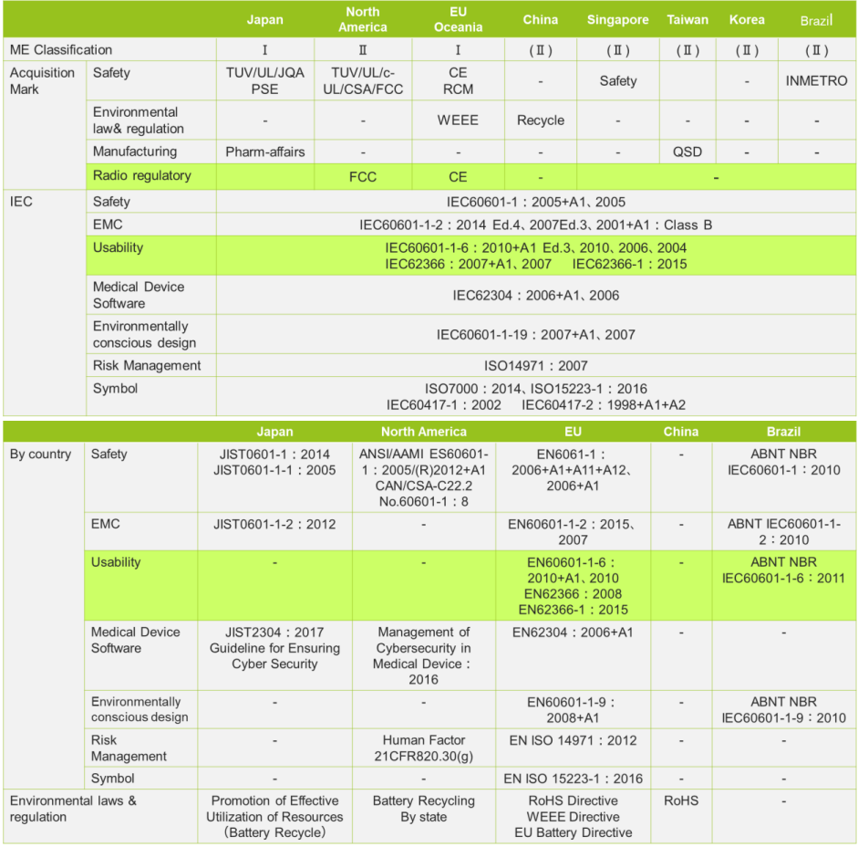

# Medical Devices
# Display & Healthcare

Group 1 Presents 

  
    Meet the Team <carbon:arrow-right class="inline"/>
  

 

<SlideCurrentNo />/<SlidesTotal />
---
transition: slide-up
preload: false
---

# Meet the Team

 

  

       
    

      卓寧文  
      電機博  
  

  

  

      
    

      邱浩宸   
      電信碩  
    

  

  

    
    

      何柏翰   
      電信碩  
    

  

  

    
   

      劉宜萱   
      生傳二    
    

  

  

    
    

      陳姿妤   
      外文四  
    

  

<SlideCurrentNo />/<SlidesTotal />

---
layout: default
transition: fade-out
---

# Table of contents

<Toc></Toc>

<SlideCurrentNo />/<SlidesTotal />

---
layout: two-cols
transition: fade-out
---

# 醫療產業趨勢: 精準醫學

* 精準 = Personalized Medicare + Healthcare
  * 個人化醫療: 專注在較微觀"個人化"
  * 健康照護(Healthcare): 專注在較宏觀的醫療量能

* 目的在於針對各個病例做最有效的
  1. **預測&預防** 
  2. **精準診斷** 
  3. **最佳治療效果**

* 實際的多領域新穎方法:
  1. 基因檢測/定序
  2. 影像醫學
  3. AI&巨量資料
  4. 醫用電子器材
  5. etc...

::right::
  

<SlideCurrentNo />/<SlidesTotal />

---
transition: fade-out
---

# 跨領域工具實例

### 1. Motif Search: 基因定序$\times$巨量資料
### 2. Medical Display: 影像醫學$\times$醫用電子
### 3. U-net: 影像醫學$\times$AI
### 4. etc .. 

台灣既有的硬體優勢結合影像醫學產業趨勢 -> <strong>Medical Display </strong>
<arrow x1="570" y1="230" x2="490" y2="150" color="#564" width="2" arrowSize="1"/>
<arrow x1="550" y1="303" x2="250" y2="430" color="#564" width="2" arrowSize="1"/>

<SlideCurrentNo />/<SlidesTotal />

---
transition: slide-up
level: 2
---
# Medical Display 介紹

* 醫用顯示器所需可靠度要求極高:
  * 任何醫學圖像在顯示器的黑點/變形/色差不能是因顯示器本身造成
  * 對任何影像傳輸的延遲幾乎零容忍 (光纖傳輸)

* 重大實際應用場景
  * **遠距手術** e.g. 達文西手臂
  * **侵入式檢測/治療** e.g. 內視鏡

* 所有醫用電子實際商轉過程

 
實際商轉例子: 

<SlideCurrentNo />/<SlidesTotal />

---
transition: slide-up
level: 2
layout: two-cols
---

# 實際商轉例子

* 以一包含醫規顯示器的醫療檢測系統為例

* **法規:** 各國依據風險或侵入程度不同分類
  * e.g. 美國 FDA 510k 將此產品歸為二級

* **標準:** 獨立於法規但會嚴重影響商品市場價值

**重要醫療等級標準:**

1. IEC-60601: 電磁相容及安全規範
2. ISO-14971: 操作風險管理
3. IEC-62366: 可用性工程 (usability)
4. IEC-62304: 軟韌體開發流程規範 生命週期及憑證 
5. Manangement of Cybersecurity in Medical Device: 2016

**AI, 醫用物聯網, 醫療資訊系統等等受到(4), (5)的限制** 

::right::

<SlideCurrentNo />/<SlidesTotal />
